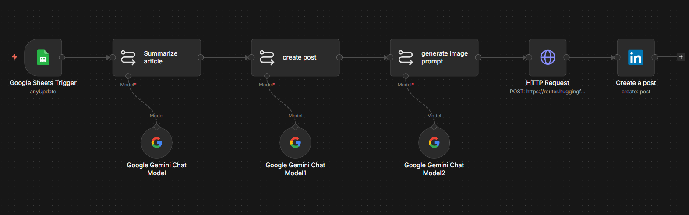

# Automated LinkedIn Content Pipeline

An n8n workflow that turns a list of article links into published LinkedIn posts — no manual writing or posting involved. Drop a link in a Google Sheet, and within the hour it's summarized, turned into a post, paired with a generated image, and published.

## What it does

1. **Watches a Google Sheet** for new rows (polls hourly).
2. **Summarizes the article** — an LLM chain pulls out the 3 key insights, any actionable advice, and keeps it under 200 words.
3. **Drafts a LinkedIn post** from that summary — written like industry commentary, with a call to action at the end.
4. **Generates an image prompt** from the post content, then **generates the actual image** via Stable Diffusion 3.
5. **Publishes the post** — text and image — straight to LinkedIn.

Each step is its own node, not one giant prompt trying to do everything at once. Made debugging a lot easier when the posts weren't coming out right early on.

## Stack

- **n8n** — orchestration
- **Google Sheets** — trigger / content queue
- **Google Gemini** — summarization, post drafting, image prompt generation (3 separate calls, one per stage)
- **Stable Diffusion 3** (via Hugging Face Inference API) — image generation
- **LinkedIn API** — publishing

## Setup

You'll need accounts/API access for: Google Sheets, Google Gemini, Hugging Face, and LinkedIn (via n8n's LinkedIn OAuth2 node).

1. Import `social-media-automation.json` into n8n.
2. Create a Google Sheet with a column for article links (see `newslinks` reference in the trigger node).
3. Reconnect each credential node — the export doesn't carry your actual keys, just placeholders. You'll need to point these at your own:
   - Google Sheets Trigger → your sheet ID
   - Google Gemini Chat Model (x3) → your Gemini API key
   - HTTP Request (image gen) → your Hugging Face API key
   - Create a post → your LinkedIn account, and swap in your own LinkedIn person URN
4. Toggle the workflow active. It'll start polling on the hour.

## Known limitations

Being upfront about this one — there's no error handling or retry logic yet. If any of the Gemini calls or the image generation step fails or times out, the run just breaks instead of retrying or falling back gracefully. Works fine for personal use where I can just re-trigger it manually, but it's not production-hardened. Next on the list:

- Retry logic on the HTTP Request node
- A fallback if image generation fails (post text-only instead of failing the whole run)
- Some logging back to the sheet so I can see which rows actually got posted vs. failed

## Why I built it

Wanted to keep a semi-regular LinkedIn presence without manually writing a post every time I read something worth sharing. This handles the whole loop from "found an interesting article" to "posted" with just a link in a spreadsheet.
